# yt-dl

1. **Reliability (Bugs):**
   - Ile bugów znalazł SonarQube?:
     - 29 
     - 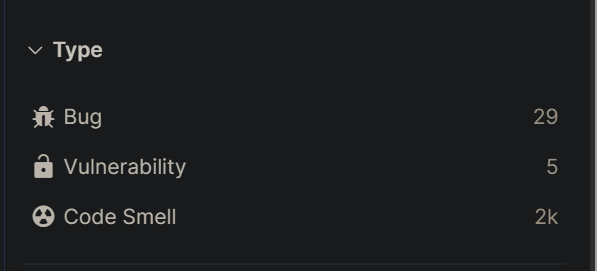
   - Jaki rating (A-E)?
     - Reliability rating: E 
     - 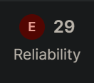
   - Podaj przykład jednego buga — co to jest i dlaczego SonarQube go flaguje?
     - `assert traverse_obj(_TEST_DATA, 1.2) == 1.2` -> Do not perform equality checks with floating point values. 
     - 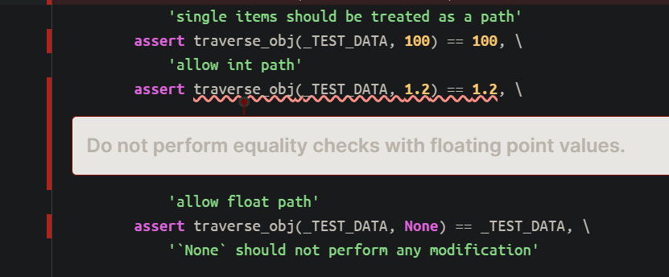

2. **Security (Vulnerabilities):**
   - Ile vulnerabilities? 
     - 5, ale 2,839 hotspots z czego 41 high, 155 + 2 + 73 medium, 2271 + 297 low
     - 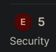
     - 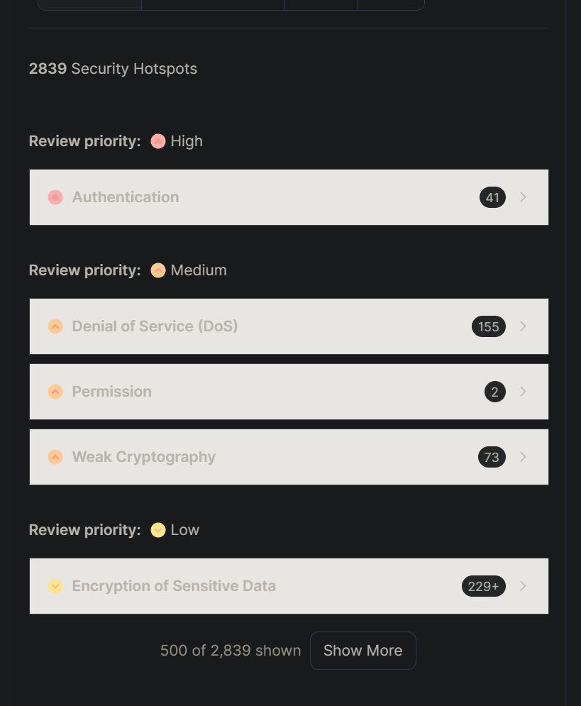
   - Jaki rating?
     - E
     - 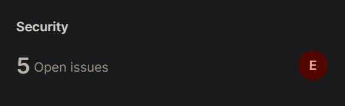
   - Czy któraś jest poważna (Critical/Blocker)?
     - Nope, ale jest dużo High

3. **Maintainability (Code Smells):**
   - Ile code smells?
     - 1,976 Open Issues
     - 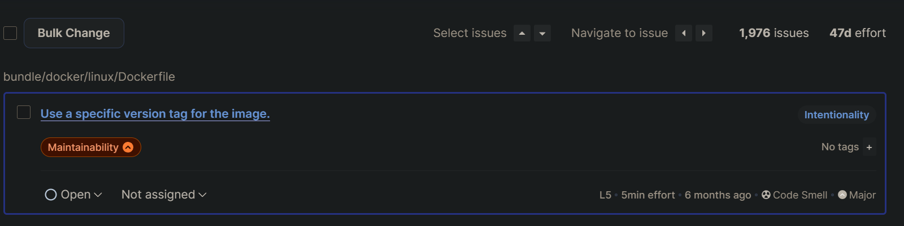
   - Jaki rating?
     - A
     - 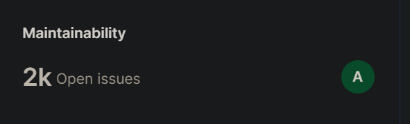
   - Jakie są top 5 najczęstszych typów code smell?
     - Define a c[onstant instead of duplicating this literal '.tiktok.com' 3 times.
     - Refactor this function to reduce its Cognitive Complexity from 21 to the 15 allowed.
     - "Complete the task associated to this ""TODO"" comment."
     - "Consider using ""assertIsNone"" instead."
     - Use concise character class syntax '\d' instead of '[0-9]'.

4. **Duplikacje:**
   - Jaki % kodu to duplikaty?
     - 0.1%
     - 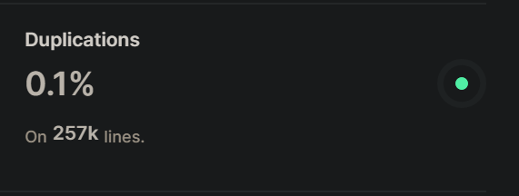
   - Który plik ma najwyższy % duplikacji?
     - yt_dlp/extractor/youtube/jsc/_director.py — 4.5%

5. Metryki:
   - Ile łącznie LOC?
     - 256771
     - 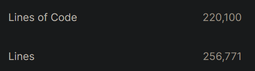
   - Jaka jest średnia złożoność cyklomatyczna?
     - 21.09
     - 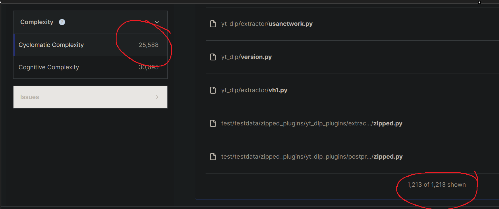
   - Ile plików ma CC > 20?
     - 280

6. **Ogólna ocena:**
   - Czy projekt "przechodzi" domyślny Quality Gate?
     - Tak
     - 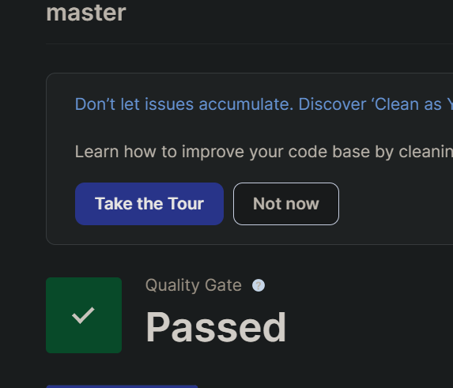
   - Jak oceniasz jakość tego projektu na podstawie wyników?
     - Źle nie jest jak na taki duży projekt, ale jest sporo do poprawy, w szczególności reliability

7. Czy LOC się zgadza z `cloc` / waszym `loc_counter.py`?
   - Total lines (LOC)  loc_counter = 255541 SonarQube = 256771 radon = 255541
   - Source lines (SLOC/ncloc)  loc_counter = 187551 SonarQube = 220100 radon = 223348
8. Czy złożoność się zgadza z `radon`?
   - Cyclomatic complexity (total)  SonarQube = 25588 radon = 39360
9. Co SonarQube znalazł, czego wasze skrypty nie złapały?
   - Bugi, vulnerabilities, code smells, duplikacje, coverage, security hotspots itp