### Zadanie 2

1. **Reliability (Bugs):**
   - Ile bugów znalazł SonarQube? 
   
     Odp. Znalazł **4 bugi** (screenshot 1.1).

     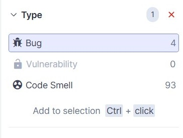
   - Jaki rating (A-E)? 
   
     Odp. Reliability overall code rating to **E**.

     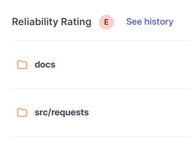
   - Podaj przykład jednego buga — co to jest i dlaczego SonarQube go flaguje? 
   
     Odp. Błąd widoczny na poniższym screenshocie jest flagowany, ponieważ `<iframe>` bez atrybutu title jest **niezgodny z zasadami dostępności** (accessibility). Jest to tylko **minor bug**.

     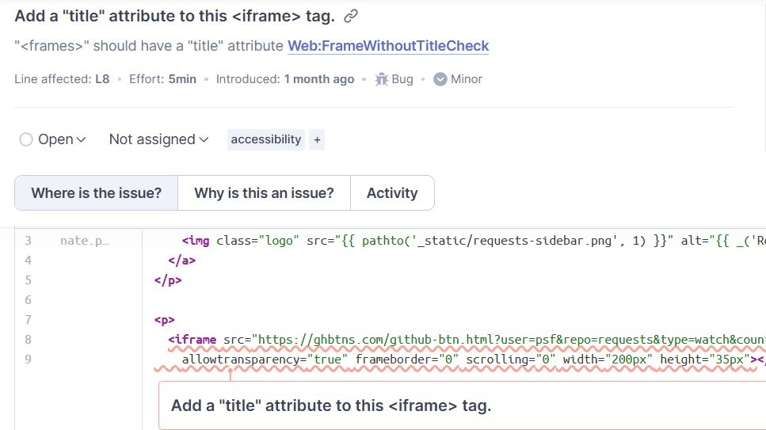

2. **Security (Vulnerabilities):**
   - Ile vulnerabilities? 
   
     Odp. **0 vulnerablilities** (screenshot 1.1).
   - Jaki rating? 
     
     Odp. **A**
     
     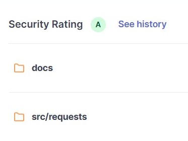
   - Czy któraś jest poważna (Critical/Blocker)? 
   
     Odp. **Nie**, bo nie ma żadnej.

3. **Maintainability (Code Smells):**
   - Ile code smells? 
   
     Odp. **93** (screenshot 1.1)
   - Jaki rating? 
   
     Odp. Maintainability overll code rating to **A**.

     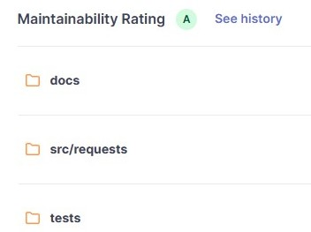   
   - Jakie są top 5 najczęstszych typów code smell? 
   
     Odp. Jeśli typy code smell to `tags` -> 5 najczęstszych to: **convension, brain-overload, suspicious, cwe i unused**.

     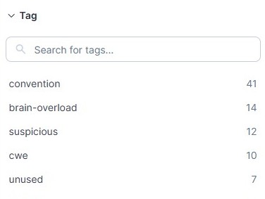 
     
     A jeśli chodziło o `clean code atribute` -> są to **consistency, intentionality i adaptability**.

     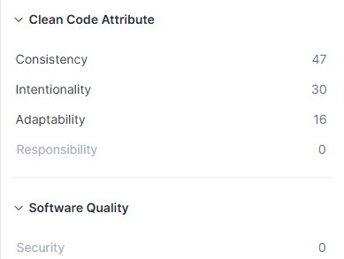 

4. **Duplikacje:**
   - Jaki % kodu to duplikaty? 
   
     Odp. **0.4%** kodu to duplikaty.

     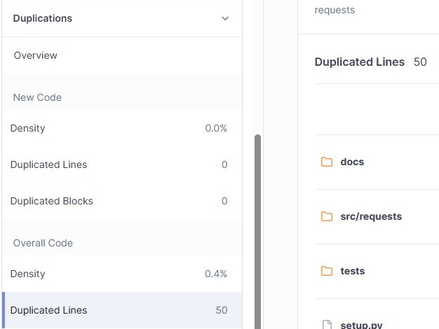
   - Który plik ma najwyższy % duplikacji? 
   
     Odp. `test_requests.py`.

     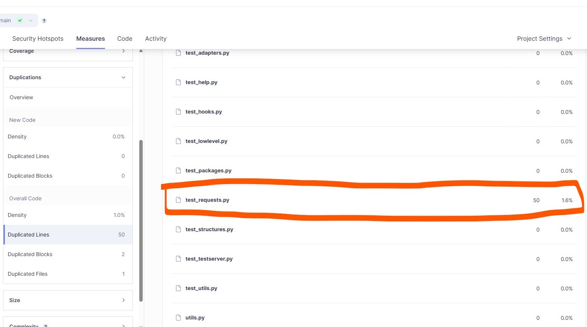

5. **Metryki:**
   - Ile łącznie LOC? 
   
     Odp. **LOC = 3 959**
     
     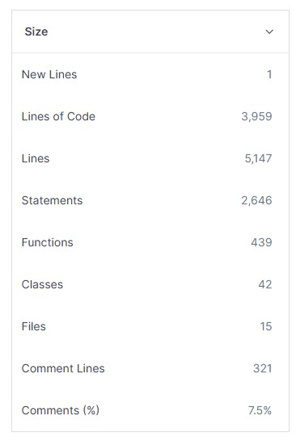
   - Jaka jest średnia złożoność cyklomatyczna? 
   
     Odp. **Sumaryczne CC = 495**, zatem:
     
     - średnie CC na plik to: **495/15 = 33**
     - średnie CC na funkcję to: **495/439 = 1.13**

     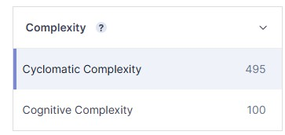
   - Ile plików ma CC > 20? 
   
     Odp. W folderze `tests\` - 3 pliki, `tests\testserver\` - 1 plik, `src\requests` - 6 plików. Czyli w sumie **10 plików**.

6. **Ogólna ocena:**
   - Czy projekt "przechodzi" domyślny Quality Gate? 
   
     Odp. **Tak**.

     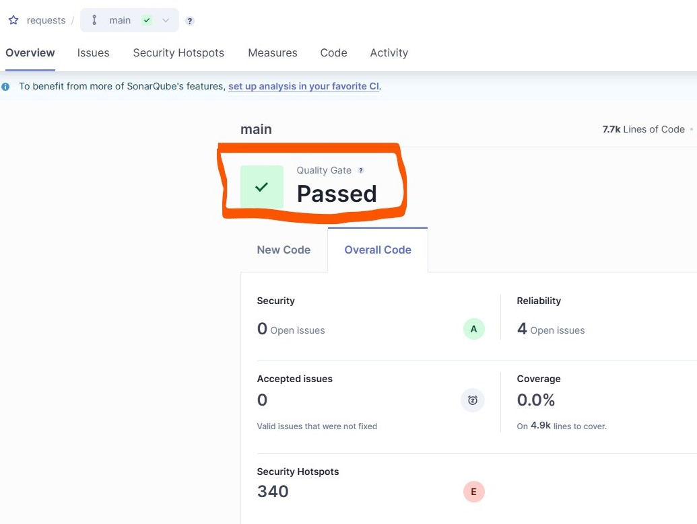
   - Jak oceniasz jakość tego projektu na podstawie wyników? 
   
     Odp. Projekt jest **bezpieczny** (security OK) i ma **mało duplikacji**, ale jednocześnie jest **trudny w utrzymaniu** i **potencjalnie nieczytelny**. Mogą w nim też pojawiać się potencjalne **problemy z niezawodnością** (4 bugs + E rating).

### Porównanie wyników SonarQube z tymi, które zostały otrzymane na wcześniejszych laboratoriach:

 - Czy LOC się zgadza z `cloc`/`loc_counter.py`?
   - SonarQube: **3 959**
   - `cloc` (tylko SLOC): **7 039**
   - `loc_counter.py` (tylko SLOC): **7 420**

   Nie, bo SonarQube raportuje znacznie mniej linii kodu niż `cloc` i `loc_counter.py`.
   
   Wiąże się to z faktem, że stosuje on własne reguły analizy kodu źródłowego. 
   
   **Pomija przy tym część plików uznanych za testowe, pomocnicze lub niespełniających kryteriów „produkcyjnego kodu”.**
   
   Dodatkowo SonarQube liczy przede wszystkim analizowalne linie kodu (ang. **executable lines**), a nie wszystkie fizyczne linie SLOC.

`cloc` oraz własny skrypt `loc_counter.py` zliczają praktycznie wszystkie niepuste linie kodu w plikach źródłowych, dlatego wyniki są wyższe.

 - Czy złożoność się zgadza z `radon`?
   - SonarQube: avg. CC = **1.13 (A)**
   - `radon`: avg. CC =  **2.84 (A)**

   Średnia złożoność cyklomatyczna raportowana przez SonarQube jest niższa niż wynik uzyskany przez `radon`, choć obie klasyfikują się jako (**A**).
   
   Przyczyną jest to, że poróœnywane narzędzia stosują różne definicje i sposoby oblicznia CC.

   Radon analizuje złożoność na poziomie funkcji i metod, uwzględniając większość instrukcji sterujących w Pythonie.
   
   SonarQube natomiast stosuje własny model complexity oraz często agreguje wyniki inaczej, np. pomijając część prostych konstrukcji lub inaczej traktując elementy składni języka.

 - Co SonarQube znalazł, czego wasze skrypty nie złapały?

   SonarQube wykrył problemy, których wcześniejsze skrypty nie analizowały między innymi:
      - **duplikacje kodu**,
      - **potencjalne błędy** (bugs),
      - **code smells** (oznaki problematycznego lub trudnego w utrzymaniu kodu), w tym nieużywane (**unused**) fragmenty

### Zadanie 3

Zostało wykonane, jak widać na poniższych screenshotach:

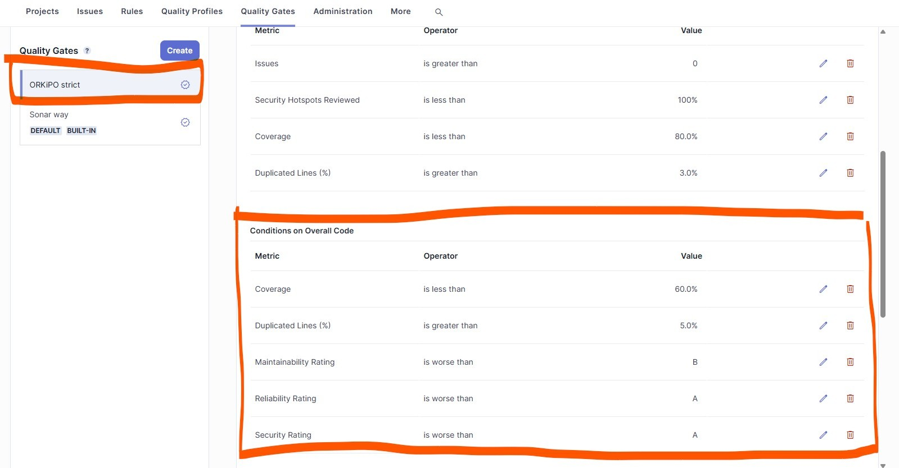

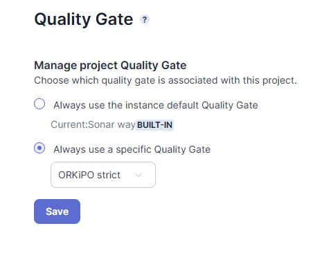
 
Nowy, bardziej restrykcyjny Quality Gate `failed`.

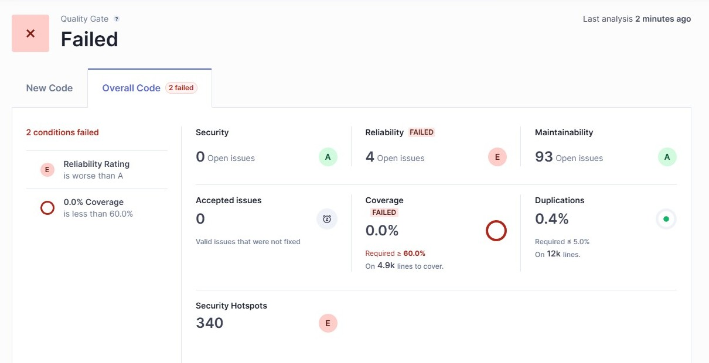
